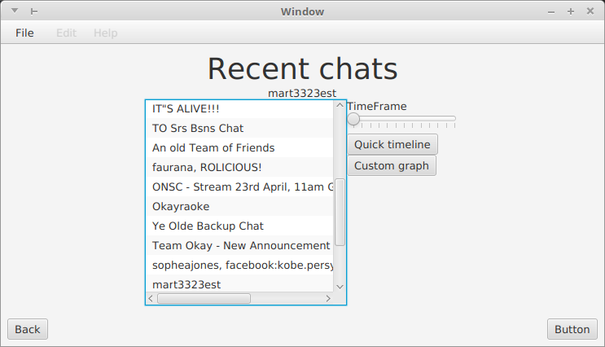
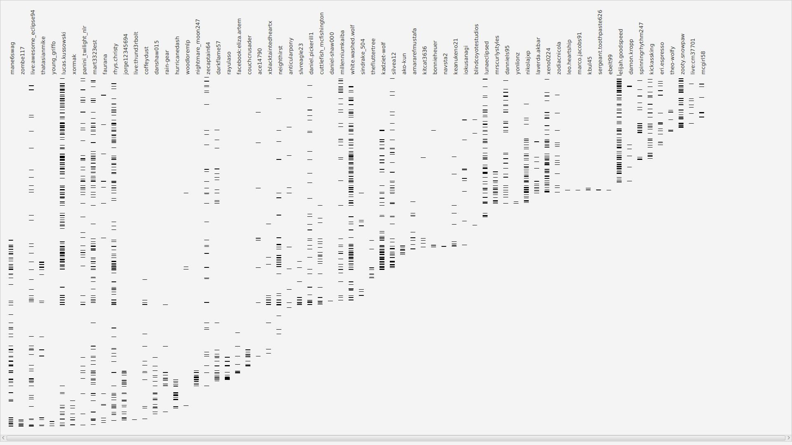

A simple tool for personal use to graph when and how much people have been talking 
in different skype chats  
Reads the database files from your own disk

## Main menu (not pictured)
Allows you to select which account to view data for (in case you have multiple)

## Chats list
Allows you to select which chat you want to view data for

## Graph view
Pops up in fullscreen and shows everyone, sorted by activity, with time going from bottom to top, 
and black lines representing messages

Can be scrolled horizontally if there are too many names
